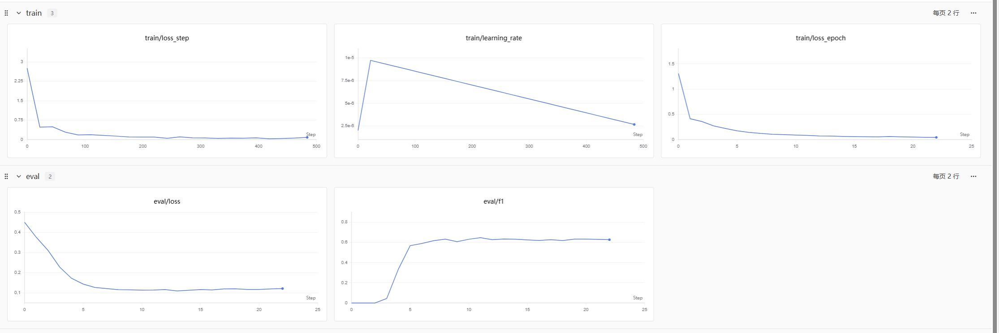
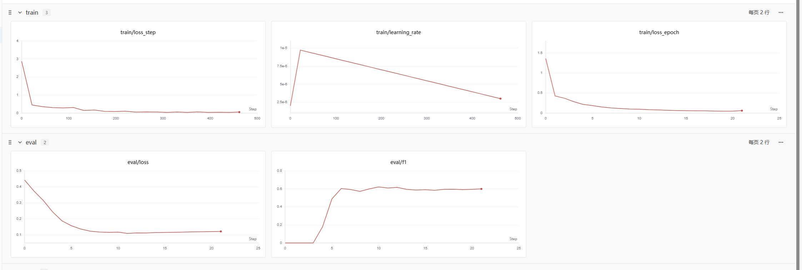

# BERT for Named Entity Recognition (NER)

基于 BERT 的中文命名实体识别（NER）项目，使用 PyTorch 和 Hugging Face Transformers 实现。

## 项目简介

本项目使用 BERT-base-chinese 预训练模型，在微博中文 NER 数据集上进行命名实体识别。数据集包含 **GPE**（地缘政治实体）、**LOC**（地点）、**ORG**（组织）、**PER**（人名）四类实体，每类实体细分为专有名词（NAM）和普通名词（NOM），加上非实体标签（O），共 17 个标签。

完整标签列表（共 17 个标签）：

| 标签 | 标签 ID | 说明 |
|------|---------|------|
| B-GPE.NAM | 0 | 地缘政治实体-专有名词-开始 |
| B-GPE.NOM | 1 | 地缘政治实体-普通名词-开始 |
| B-LOC.NAM | 2 | 地点-专有名词-开始 |
| B-LOC.NOM | 3 | 地点-普通名词-开始 |
| B-ORG.NAM | 4 | 组织-专有名词-开始 |
| B-ORG.NOM | 5 | 组织-普通名词-开始 |
| B-PER.NAM | 6 | 人名-专有名词-开始 |
| B-PER.NOM | 7 | 人名-普通名词-开始 |
| I-GPE.NAM | 8 | 地缘政治实体-专有名词-内部 |
| I-GPE.NOM | 9 | 地缘政治实体-普通名词-内部 |
| I-LOC.NAM | 10 | 地点-专有名词-内部 |
| I-LOC.NOM | 11 | 地点-普通名词-内部 |
| I-ORG.NAM | 12 | 组织-专有名词-内部 |
| I-ORG.NOM | 13 | 组织-普通名词-内部 |
| I-PER.NAM | 14 | 人名-专有名词-内部 |
| I-PER.NOM | 15 | 人名-普通名词-内部 |
| O | 16 | 非实体 |

## 项目结构

```
bert-ner/
├── args/                    # 配置文件
│   ├── arg1.json           # 实验配置 1
│   └── arg2.json           # 实验配置 2
├── checkpoint/             # 模型检查点
│   └── exp*/              # 实验记录
│       └── log.jsonl      # 训练日志
├── data/                   # 数据集
│   ├── train.txt          # 训练集
│   ├── dev.txt            # 验证集
│   ├── test.txt           # 测试集
│   ├── label2id.json      # 标签映射
│   └── class.txt          # 类别信息
├── MyDataset.py           # 数据集加载器
├── model.py               # 模型定义
├── trainer.py             # 训练流程
├── utils.py               # 工具函数
├── requirements.txt       # 依赖包
└── README.md              # 项目文档
```

## 环境安装

```bash
pip install -r requirements.txt
```

### 核心依赖

- pandas==1.2.4
- swanlab==0.7.19
- torch==2.8.0
- tqdm==4.67.1
- transformers==4.35.0
- numpy==1.21.5


## 配置说明

配置文件位于 `args/arg1.json`：

```json
{
  "num_epochs": 30,                   // 最大训练轮数
  "batch_size": 64,                   // 每批样本数量
  "lr": 1e-5,                         // 学习率
  "weight_decay": 0.01,               // 权重衰减（L2正则）
  "device": "cuda:0",                 // 使用的设备（GPU/CPU）
  "model_dir": "../bert-base-chinese", // 预训练BERT模型路径
  "dropout_rate": 0.2,                // 分类层的Dropout比例
  "align_type": "ignore",             // 标签对齐方式：ignore=仅首subtoken, other=标签传播
  "embedding_dim": 768,               // BERT输出向量维度
  "data_path": "./data/",             // 数据集目录
  "max_length": 128,                  // 输入序列最大长度
  "patience": 10,                     // Early stopping容忍轮数
  "monitor": "val_f1",                // 早停监控指标
  "delta": 0.0001,                    // 早停最小变化阈值
  "save_dir": "./checkpoint",         // 模型保存路径
  "warmup_steps": 5,                  // 学习率预热步数
  "eps": 1e-8                         // 数值稳定参数
}
```

## 使用方法

### 训练模型

```bash
python trainer.py --arg ./args/arg1.json
```


### 数据格式

数据文件采用 BIO 标注格式，每行一个词和标签，用空格分隔，句子之间用空行分隔：

```
北 B-LOC.NAM
京 I-LOC.NAM
是 O
中 B-GPE.NAM
国 I-GPE.NAM
的 O
首 O
都 O

```

## 实验结果

### 实验设置

| 项目 | 说明 |
|------|------|
| 预训练模型 | bert-base-chinese |
| 最大序列长度 | 128 |
| Batch size | 64 |
| 学习率 | 1e-5 |
| 最大训练轮数 | 30 |
| Early stopping patience | 10 |
| 优化器 | AdamW (weight_decay=0.01) |
| 学习率调度 | 线性预热 (warmup_steps=5) |

本项目对比了两种 **标签对齐策略**（subtoken 对齐方式），以处理 BERT tokenizer 分词后与原始 BIO 标签长度不一致的问题：

- **First-Subtoken Strategy** (`align_type="ignore"`)：仅保留每个 token 的第一个 subtoken 的原始标签，其余 subtoken 设为 `-100`（忽略）。该策略严格匹配原始标注位置。
- **Label Propagation** (`align_type="other"`)：将 token 的标签传播给其所有 subtoken（B 标签只保留首个，后续 subtoken 转为 I 标签）。该策略将标签信息扩散到所有 subtoken。

### 各类别详细结果

#### First-Subtoken Strategy (`arg1.json`)

| 实体类别 | Precision | Recall | F1 | Support |
|----------|-----------|--------|-----|---------|
| GPE.NAM | 0.5185 | 0.9130 | 0.6614 | 46 |
| GPE.NOM | 0.0000 | 0.0000 | 0.0000 | 2 |
| LOC.NAM | 0.0000 | 0.0000 | 0.0000 | 19 |
| LOC.NOM | 0.0000 | 0.0000 | 0.0000 | 9 |
| ORG.NAM | 0.4286 | 0.2308 | 0.3000 | 39 |
| ORG.NOM | 0.0000 | 0.0000 | 0.0000 | 16 |
| PER.NAM | 0.5704 | 0.7000 | 0.6286 | 110 |
| PER.NOM | 0.6474 | 0.7365 | 0.6891 | 167 |
| **micro avg** | **0.5878** | **0.6152** | **0.6012** | — |

#### Label Propagation (`arg2.json`)

| 实体类别 | Precision | Recall | F1 | Support |
|----------|-----------|--------|-----|---------|
| GPE.NAM | 0.6393 | 0.8478 | 0.7290 | 46 |
| GPE.NOM | 0.0000 | 0.0000 | 0.0000 | 2 |
| LOC.NAM | 0.0000 | 0.0000 | 0.0000 | 19 |
| LOC.NOM | 0.0000 | 0.0000 | 0.0000 | 9 |
| ORG.NAM | 0.4286 | 0.1538 | 0.2264 | 39 |
| ORG.NOM | 0.0000 | 0.0000 | 0.0000 | 16 |
| PER.NAM | 0.5448 | 0.7182 | 0.6196 | 110 |
| PER.NOM | 0.6596 | 0.7425 | 0.6986 | 167 |
| **micro avg** | **0.6078** | **0.6078** | **0.6078** | — |


### 训练过程

#### First-Subtoken Strategy


#### Label Propagation

