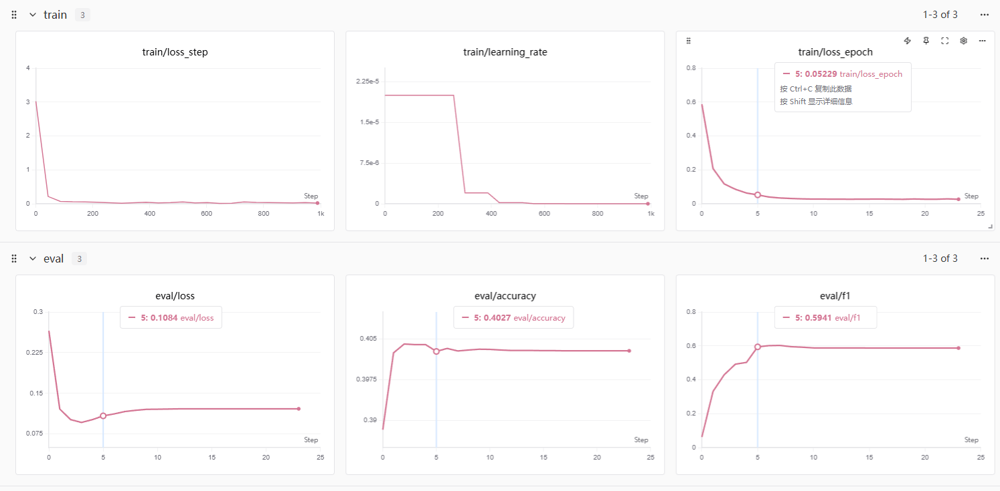
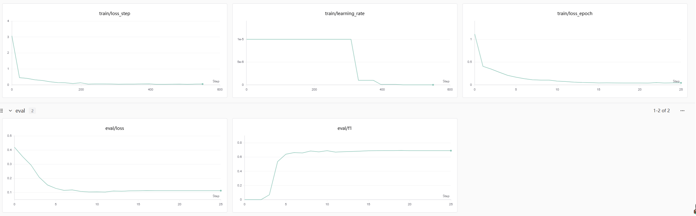

# BERT for Named Entity Recognition (NER)

基于 BERT 的中文命名实体识别（NER）项目，使用 PyTorch 和 Hugging Face Transformers 实现。

## 项目简介


完整标签列表（共 17 个标签）：

| 标签 | 标签 ID | 说明 |
|------|---------|------|
| B-GPE.NAM | 0 | 地缘政治实体-专有名词-开始 |
| B-GPE.NOM | 1 | 地缘政治实体-普通名词-开始 |
| B-LOC.NAM | 2 | 地点-专有名词-开始 |
| B-LOC.NOM | 3 | 地点-普通名词-开始 |
| B-ORG.NAM | 4 | 组织-专有名词-开始 |
| B-ORG.NOM | 5 | 组织-普通名词-开始 |
| B-PER.NAM | 6 | 人名-专有名词-开始 |
| B-PER.NOM | 7 | 人名-普通名词-开始 |
| I-GPE.NAM | 8 | 地缘政治实体-专有名词-内部 |
| I-GPE.NOM | 9 | 地缘政治实体-普通名词-内部 |
| I-LOC.NAM | 10 | 地点-专有名词-内部 |
| I-LOC.NOM | 11 | 地点-普通名词-内部 |
| I-ORG.NAM | 12 | 组织-专有名词-内部 |
| I-ORG.NOM | 13 | 组织-普通名词-内部 |
| I-PER.NAM | 14 | 人名-专有名词-内部 |
| I-PER.NOM | 15 | 人名-普通名词-内部 |
| O | 16 | 非实体 |

## 项目结构

```
bert-ner/
├── args/                    # 配置文件
│   ├── arg1.json           # 实验配置 1
│   └── arg2.json           # 实验配置 2
├── checkpoint/             # 模型检查点
│   └── exp*/              # 实验记录
│       └── log.jsonl      # 训练日志
├── data/                   # 数据集
│   ├── train.txt          # 训练集
│   ├── dev.txt            # 验证集
│   ├── test.txt           # 测试集
│   ├── label2id.json      # 标签映射
│   └── class.txt          # 类别信息
├── MyDataset.py           # 数据集加载器
├── model.py               # 模型定义
├── trainer.py             # 训练流程
├── utils.py               # 工具函数
├── requirements.txt       # 依赖包
└── README.md              # 项目文档
```

## 环境安装

```bash
pip install -r requirements.txt
```

### 核心依赖

- PyTorch >= 2.5.1
- Transformers >= 4.51.3
- SwanLab >= 0.7.5 (实验跟踪)
- Datasets >= 3.5.0
- Pandas >= 2.2.3
- NumPy >= 1.26.3

## 配置说明

配置文件位于 `args/arg1.json`：

```json
{
  "num_epochs": 30,                 // 最大训练轮数
  "batch_size": 64,                 // 每批样本数量
  "lr": 1e-5,                       // 学习率
  "weight_decay": 0.01,             // 权重衰减（L2正则）
  "device": "cuda:0",               // 使用的设备（GPU/CPU）
  "model_dir": "../bert-base-chinese", // 预训练BERT模型路径
  "dropout_rate": 0.2,              // 分类层的Dropout比例
  "align_type": "ignore",           // 标签对齐方式（仅首subtoken保留标签）
  "embedding_dim": 768,             // BERT输出向量维度
  "data_path": "./data/",           // 数据集目录
  "max_length": 128,                // 输入序列最大长度
  "patience": 5,                    // Early stopping容忍轮数
  "monitor": "val_f1",              // 监控指标（用于早停和保存）
  "delta": 0.0001,                  // 指标最小改进阈值
  "save_dir": "./checkpoint"        // 模型保存路径
}
```

## 使用方法

### 训练模型

```bash
python trainer.py --arg ./args/arg1.json
```


### 数据格式

数据文件采用 BIO 标注格式，每行一个词和标签，用空格分隔，句子之间用空行分隔：

```
北 B-LOC.NAM
京 I-LOC.NAM
是 O
中 B-GPE.NAM
国 I-GPE.NAM
的 O
首 O
都 O

```

## 实验结果


#### 各类别详细结果
#### Label Propagation
| 实体类别     | Precision | Recall   | F1-Score | Support |
|--------------|-----------|----------|----------|---------|
| `GPE.NAM`    | 61.43%    | 93.48%   | 74.14%   | 46      |
| `GPE.NOM`    | 0.00%     | 0.00%    | 0.00%    | 2       |
| `LOC.NAM`    | 0.00%     | 0.00%    | 0.00%    | 19      |
| `LOC.NOM`    | 0.00%     | 0.00%    | 0.00%    | 9       |
| `ORG.NAM`    | 39.02%    | 42.11%   | 40.51%   | 38      |
| `ORG.NOM`    | 0.00%     | 0.00%    | 0.00%    | 16      |
| `PER.NAM`    | 54.78%    | 78.90%   | 64.66%   | 109     |
| `PER.NOM`    | 60.87%    | 77.30%   | 68.11%   | 163     |
| Micro Avg| 57.05%    | 67.41%   | 61.80% | —    |
##### First-Subtoken Strategy
| 实体类别 | Precision | Recall | F1-Score | Support |
|-------------|-----------|--------|----------|---------|
| `GPE.NAM`     | 73.77%    | 97.83% | 84.11%   | 46      |
| `GPE.NOM`     | 0.00%     | 0.00%  | 0.00%    | 2       |
| `LOC.NAM`     | 33.33%    | 15.79% | 21.43%   | 19      |
| `LOC.NOM`     | 50.00%    | 22.22% | 30.77%   | 9       |
| `ORG.NAM`     | 44.74%    | 44.74% | 44.74%   | 38      |
| `ORG.NOM`     | 33.33%    | 6.25%  | 10.53%   | 16      |
| `PER.NAM`     | 59.57%    | 77.
| PER.NOM     | 69.06%    | 76.69% | 72.67%   | 163     |
| **Micro Avg** | **63.39%** | **68.91%** | **66.03%** | — |
#### 训练过程
##### Label Propagation方式

##### First-Subtoken Strategy

